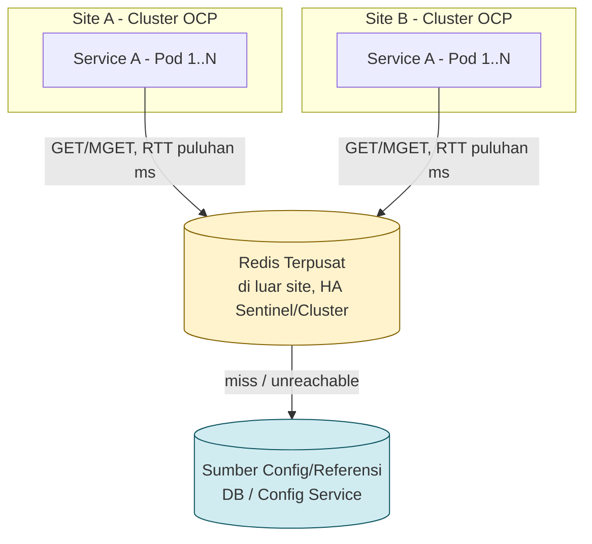

# Review Arsitektur: Redis Terpusat untuk Cache Data Config/Referensi Lintas Site

## Konteks

- Dua site (A dan B), masing-masing punya cluster OCP dengan microservice yang sama (misal Service A) berjalan di kedua site.
- Data yang di-cache adalah **data config/referensi**: sama untuk semua instance, slow-changing, dan re-fetchable dari sumber aslinya (DB/config service).
- Tujuan: satu sumber cache yang bisa diakses oleh Service A di site A maupun site B, menggantikan cache internal Caffeine yang saat ini terpisah per site dan berpotensi tidak sinkron.
- Redis dideploy terpusat di luar kedua site (sama seperti penempatan Kong saat ini).
- Latensi lintas site ke lokasi Redis: **maksimal puluhan ms** (level WAN, bukan sub-1ms dalam satu data center).
- Keputusan: **Redis terpusat tanpa L1 cache lokal**, dengan asumsi lookup config bukan di hot path per-request dan latency budget-nya longgar.

---

## Topologi



## Alur Baca

1. Setiap lookup config dari Service A (site A maupun site B) langsung ke Redis terpusat — kena RTT puluhan ms setiap kali, bukan hanya saat cache cold.
2. Kalau Redis timeout atau unreachable (circuit breaker open) → fallback ke sumber config asli (DB/config service).
3. Kalau Redis miss (key belum ada/expired) → ambil dari sumber config asli, lalu isi Redis.

## Karakteristik

| Aspek | Detail |
|---|---|
| Latency | + puluhan ms di setiap lookup config |
| Konsistensi | Satu sumber kebenaran tunggal — tidak ada layer lokal yang bisa basi |
| Kompleksitas | Rendah — satu layer cache, satu TTL, tanpa invalidasi lintas layer |
| Cocok untuk | Lookup config dengan frekuensi rendah per pod, di luar hot path request, latency budget longgar |

---

## Prasyarat Sebelum Implementasi

- **Volume command ke Redis dihitung nyata**: (jumlah pod site A + site B) × frekuensi lookup per pod — bukan asumsi "jarang". Kalau angkanya mulai ratusan–ribuan command/detik, opsi ini perlu ditinjau ulang.
- **Endpoint/consumer yang melakukan lookup config dipetakan**, pastikan tidak ada yang berada di jalur request dengan SLA ketat.
- **Pipelining/batching** (`MGET`, pipeline Lettuce) dipakai kalau satu request butuh beberapa key config sekaligus, agar tidak jadi N round-trip sekuensial (N × puluhan ms).

## Mitigasi Wajib

- **Redis diperlakukan optional**: timeout command pendek dan eksplisit (connect ~100–200 ms, command ~200–500 ms, sesuaikan dengan RTT terukur + margin), circuit breaker (Resilience4j), `CacheErrorHandler` yang menelan error Redis dan fallback ke sumber data — jangan sampai Redis down membuat config lookup gagal total.
- **Connection pooling** yang benar dan koneksi di-reuse (bukan connect per request) — dengan RTT puluhan ms, biaya membuka koneksi baru mahal.
- **HA Redis** (Sentinel atau Cluster, minimal 3 node) di satu lokasi. **Jangan direntang lintas site/WAN** — gossip dan failover Redis tidak dirancang untuk itu.
- **Serialisasi JSON/Protobuf**, bukan Java serialization, agar rolling deploy antar versi service tidak pecah karena perbedaan schema.
- **Key bernamespace dan berversi**: `{service}:{env}:{version}:{entity}:{id}` — memudahkan invalidasi saat skema config berubah.
- **TTL per key** (bukan tanpa TTL), `maxmemory` dengan eviction policy `allkeys-lru`/`allkeys-lfu`.
- **TLS + ACL per service**, akses dibatasi hanya dari egress cluster OCP (pertimbangkan egress IP di OCP agar firewall rule bisa spesifik).
- **Observability**: command rate ke Redis, latency p99 dari sisi klien, evicted keys, memory usage, connected clients, replication lag — semua terhubung ke sistem monitoring yang sudah ada.

---

---

## Stack Teknis

| Komponen | Versi | Catatan |
|---|---|---|
| Java | 21 (LTS) | Sesuai service existing |
| Spring Boot | 3.x | Sesuai service existing |
| Redis server | 7.2.x (Stable) | Minimum 7.x agar kompatibel penuh dengan fitur client modern; hindari versi EOL (6.x sudah EOL) |
| Redis client | Lettuce (default Spring Boot) | Non-blocking, mendukung auto-reconnect — lebih sesuai untuk RTT puluhan ms dibanding Jedis (blocking) |
| Resilience4j | 2.2.x (Spring Boot 3 starter) | Circuit breaker di sekitar akses Redis |

Lettuce dipilih (bukan Jedis) karena berbasis Netty/non-blocking dan punya `autoReconnect` serta `topology refresh` bawaan — relevan karena akses Redis di topologi ini lintas site dengan RTT puluhan ms, dan bawaan Spring Boot 3 starter sehingga tidak perlu override client tambahan.

## Dependency (Maven)

```xml
<dependencies>
    <dependency>
        <groupId>org.springframework.boot</groupId>
        <artifactId>spring-boot-starter-data-redis</artifactId>
    </dependency>
    <dependency>
        <groupId>org.springframework.boot</groupId>
        <artifactId>spring-boot-starter-cache</artifactId>
    </dependency>
    <dependency>
        <groupId>io.github.resilience4j</groupId>
        <artifactId>resilience4j-spring-boot3</artifactId>
        <version>2.2.0</version>
    </dependency>
</dependencies>
```

## Konfigurasi Koneksi — Timeout Pendek + Connection Pooling

```java
@Configuration
public class RedisConfig {

    @Bean
    public LettuceConnectionFactory redisConnectionFactory(
            @Value("${redis.host}") String host,
            @Value("${redis.port}") int port,
            @Value("${redis.password}") String password) {

        RedisStandaloneConfiguration standalone = new RedisStandaloneConfiguration(host, port);
        standalone.setPassword(RedisPassword.of(password));

        GenericObjectPoolConfig<?> poolConfig = new GenericObjectPoolConfig<>();
        poolConfig.setMaxTotal(20);
        poolConfig.setMaxIdle(10);
        poolConfig.setMinIdle(2);
        poolConfig.setMaxWait(Duration.ofMillis(300));

        LettucePoolingClientConfiguration clientConfig = LettucePoolingClientConfiguration.builder()
                .poolConfig(poolConfig)
                .commandTimeout(Duration.ofMillis(400)) // sesuaikan RTT terukur + margin
                .clientOptions(ClientOptions.builder()
                        .socketOptions(SocketOptions.builder()
                                .connectTimeout(Duration.ofMillis(200))
                                .keepAlive(true)
                                .build())
                        .disconnectedBehavior(ClientOptions.DisconnectedBehavior.REJECT_COMMANDS)
                        .autoReconnect(true)
                        .build())
                .useSsl() // aktifkan sesuai kebijakan TLS
                .build();

        return new LettuceConnectionFactory(standalone, clientConfig);
    }
}
```

## CacheManager — TTL per Cache + Serialisasi JSON

```java
@Configuration
@EnableCaching
public class CacheConfig {

    @Bean
    public RedisCacheManager cacheManager(RedisConnectionFactory connectionFactory) {

        ObjectMapper mapper = JsonMapper.builder()
                .addModule(new JavaTimeModule())
                .activateDefaultTyping(
                        BasicPolymorphicTypeValidator.builder()
                                .allowIfSubType(Object.class)
                                .build(),
                        ObjectMapper.DefaultTyping.NON_FINAL)
                .build();

        GenericJackson2JsonRedisSerializer jsonSerializer =
                new GenericJackson2JsonRedisSerializer(mapper);

        RedisCacheConfiguration baseConfig = RedisCacheConfiguration.defaultCacheConfig()
                .entryTtl(Duration.ofMinutes(5))
                .serializeKeysWith(RedisSerializationContext.SerializationPair
                        .fromSerializer(new StringRedisSerializer()))
                .serializeValuesWith(RedisSerializationContext.SerializationPair
                        .fromSerializer(jsonSerializer))
                .disableCachingNullValues();

        Map<String, RedisCacheConfiguration> perCacheConfig = Map.of(
                "productConfig", baseConfig.entryTtl(Duration.ofMinutes(10)),
                "pricingRules", baseConfig.entryTtl(Duration.ofMinutes(2)),
                "featureFlags", baseConfig.entryTtl(Duration.ofSeconds(30))
        );

        return RedisCacheManager.builder(connectionFactory)
                .cacheDefaults(baseConfig)
                .withInitialCacheConfigurations(perCacheConfig)
                .build();
    }
}
```

Value disimpan sebagai JSON (bukan Java serialization) agar rolling deploy antar versi service tidak pecah. Untuk versi skema, sertakan versi di nama cache (mis. `productConfig-v2`) agar breaking change tidak collision dengan cache lama.

## CacheErrorHandler — Redis Gagal Tidak Boleh Menggagalkan Request

```java
@Configuration
public class CacheErrorConfig implements CachingConfigurer {

    private static final Logger log = LoggerFactory.getLogger(CacheErrorConfig.class);

    @Override
    public CacheErrorHandler errorHandler() {
        return new CacheErrorHandler() {
            @Override
            public void handleCacheGetError(RuntimeException e, Cache cache, Object key) {
                log.warn("Redis GET gagal, cache={}, key={}, fallback ke sumber data", cache.getName(), key, e);
            }

            @Override
            public void handleCachePutError(RuntimeException e, Cache cache, Object key, Object value) {
                log.warn("Redis PUT gagal, cache={}, key={}", cache.getName(), key, e);
            }

            @Override
            public void handleCacheEvictError(RuntimeException e, Cache cache, Object key) {
                log.warn("Redis EVICT gagal, cache={}, key={}", cache.getName(), key, e);
            }

            @Override
            public void handleCacheClearError(RuntimeException e, Cache cache) {
                log.warn("Redis CLEAR gagal, cache={}", cache.getName(), e);
            }
        };
    }
}
```

## Circuit Breaker di Sekitar Akses Redis

```yaml
resilience4j:
  circuitbreaker:
    instances:
      redisConfig:
        sliding-window-size: 20
        minimum-number-of-calls: 10
        failure-rate-threshold: 50
        wait-duration-in-open-state: 5s
        permitted-number-of-calls-in-half-open-state: 3
  timelimiter:
    instances:
      redisConfig:
        timeout-duration: 400ms
```

```java
@Service
@RequiredArgsConstructor
public class ProductConfigService {

    private final ProductConfigRepository repository; // sumber asli (DB)

    @CircuitBreaker(name = "redisConfig", fallbackMethod = "fetchFromSource")
    @Cacheable(cacheNames = "productConfig", key = "#productId")
    public ProductConfig getProductConfig(String productId) {
        return repository.findConfigById(productId)
                .orElseThrow(() -> new ProductConfigNotFoundException(productId));
    }

    private ProductConfig fetchFromSource(String productId, Throwable t) {
        log.warn("Circuit breaker open untuk Redis, fetch langsung dari DB, productId={}", productId, t);
        return repository.findConfigById(productId)
                .orElseThrow(() -> new ProductConfigNotFoundException(productId));
    }
}
```

Catatan: kombinasi `@CircuitBreaker` + `@Cacheable` pada method yang sama perlu diuji urutan Spring AOP proxy-nya. Kalau urutan jadi masalah, alternatifnya panggil `RedisTemplate` langsung di dalam method yang dibungkus try-catch/circuit breaker manual — lebih verbose tapi lebih predictable.

## Batching — MGET untuk Beberapa Key Sekaligus

```java
public Map<String, ProductConfig> getProductConfigs(List<String> productIds) {
    List<String> keys = productIds.stream()
            .map(id -> "productConfig::" + id)
            .toList();

    List<ProductConfig> values = redisTemplate.opsForValue().multiGet(keys);
    // handle null (miss) per index, fallback ke DB untuk yang miss, lalu multiSet balik ke Redis
    ...
}
```

Menghindari N sequential round-trip (N × puluhan ms RTT) saat satu request butuh beberapa config key.

## application.yml — Ringkasan

```yaml
spring:
  cache:
    type: redis
  data:
    redis:
      timeout: 400ms
      lettuce:
        pool:
          max-active: 20
          max-idle: 10
          min-idle: 2

redis:
  host: ${REDIS_HOST}
  port: ${REDIS_PORT}
  password: ${REDIS_PASSWORD}
```

## Catatan Java 21 — Virtual Threads

Tidak ada dependency khusus untuk Java 21, tapi kalau service ini nantinya mengaktifkan virtual threads (`spring.threads.virtual.enabled=true`), Lettuce secara default non-blocking dan aman dipakai bersamanya. Pastikan `maxTotal` connection pool disesuaikan lewat load test, karena volume concurrent request bisa jauh lebih tinggi dengan virtual threads dibanding thread pool platform biasa.

---

## Titik Revisit

Opsi ini bukan keputusan permanen. Pertimbangkan menambahkan **L1 cache lokal (Caffeine)** di depan Redis — sebagai penambahan lapisan, bukan migrasi ulang — kalau salah satu sinyal berikut muncul dari data produksi:

- Command rate ke Redis ternyata tinggi secara agregat setelah dihitung nyata dari jumlah pod × frekuensi lookup.
- Latency p99 endpoint yang memakai lookup config mulai menekan SLA.
- Muncul kebutuhan baru: config dipakai di jalur request yang sensitif latency (API publik, proses real-time).

Pastikan command rate dan latency Redis dari sisi klien sudah diawasi sejak awal implementasi, supaya sinyal revisit ini terlihat dari data, bukan baru ketahuan saat sudah jadi insiden.
